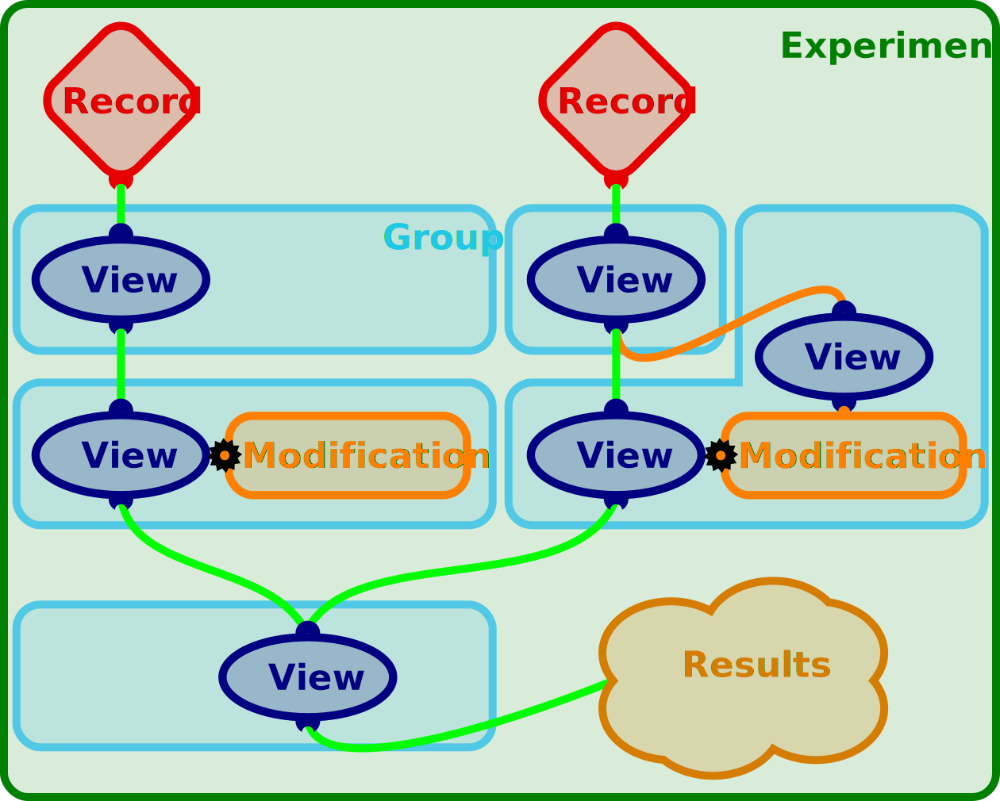

The structure and components of PyOTI
=====================================

Region
------
A `Region` defines a range of data. Think of it as a timespan selected from
given data, with a minimum (`tmin`) and a maximum time (`tmax`), or a `start`
and a `stop` index. A Region provides methods to easily get and set tmin/start
and tmax/stop. Data can be retrieved with the method `get_data()`. The method
`get_data()` will (per default) return the data of the selected timespan.
Additionally, traces can be chosen.
A Region also gives access to parameters of the data, like the
samplingrate and the name of the traces. The data can be cached. A
Region can be concretized by either a Record or a View, which means a
Record and a View have all the functionality of a Region.
A Region gets its data from one or more parents (roots/ancestors/
parents) and lets children access its own data (nodes/descendants/
children).

Record
------
A `Record` provides the access to the raw data and its parameters, i.e.
the binary data file, the samplingrate the data was recorded with, a
calibration of the traces, the name of the traces, and (setup specific)
correction factors of the traces. It has all the functionality a
`Region` provides (in fact, it *is* a `Region`). Instead of a parent, a
Record gets the raw data from a `DataSource`. A `DataSource` reads the 
raw data from a file or other sources. Therefore, tmin and tmax cannot
be set in a `Record`, but instead are defined by the raw data: `tmin`
is alway 0 and `tmax` equals the duration of the raw data.

View
----
A View provides the access to the data of other Regions. In contrast to
a Record, a View gets its data from at least one parent that can be
either a Record or a View. A View can have mutiple parents, too. If a
View has multiple parents, it will concatenate the data from all
parents one after another. A View has all the functionality a Region
provides (in fact, it *is* a Region). Optionally, A View can have a
Modification associated with it (`modificiations_apply`), which will
modify the data, before it is returned by `get_data()`.

Modification
------------
A Modification modifies the data of a View (the applied View). The
Modification can get data from another View (the based View), to
calculate parameters that determine, how the applied View should be
modified.
A simple example is an automatic detection of an offset from the data
of one View (the based View) and appropriate modificiation of the data
according to the offset of another View (the applied View).

Group
-----
A group can be any combination of a View or a View and one or more
Modifications. It has at least one data input (the input that the 
View and/or the Modifications get the data from) and one data output 
(the ouptut that is used as an input for the next group).
If the group consists of only a View, it is a *selection* group. If the
group additionally has a Modification included, it as a *modifying*
group. For more details see the method `add_group()`.

Experiment
----------

The above explained components can be variously combined, to read in, select 
subregions of, and modify the data. The information of these process, i.e. the
individual records, views, and modifications and the structure of their
network, is administered and stored in an experiment. An example of the
structure of such an experiment is shown in the image below.

Data from two different records (red) was read into the experiment. From the
data (green line) of the left record a subregion is selected with a view
(blue). Then, the data is selected by another view and modified by a
modification (orange). From the data of the right record a subregion is
selected, too. The data from this selection splits into two paths. The data on
the orange path is selected by another view to serve as an input to calculate a
modification, which in turn modifies the data on the green path.
Both data strands, the left and the right one, are combined (concatenated) with
a last view. After the data has passed all different groups, which select,
modify, and/or combine it, the processed data can be evaluated further to
extract the results.

Import the PyOTI package
========================
All functions needed to investigate and analyse your data are in the PyOTI
package. To be able to use this package, you need to import it::

    import pyoti

You should be greeted with the version number and the actual working path.

Create an Experiment
====================
The functions and objects that help you to access, analyse, and modify your
data are organized and stored in an experiment. Therefore, you have to create
an experiment::
    
    #Create an experiment
    experiment = pyoti.create_experiment()

After you have created the experiment, you have to open/initialize it. This
will implicitly create a new temporary experiment file, where all the data and
modifications are (temporarily) stored in::

    # Open a new experiment
    experiment.open()

Alternatively, you can provide a filename that the experiment will use to 
permanently store the data in. If the file does not exist yet, it will be
created for you. If the file already exists, it will be opened and no new one
will be created::

    # Provide a relative or absolute filename for the experiment
    filename = './experiment-01.fs'

    # Create a new or open an already existing experiment file
    experiment.open(filename)

Later, when you have finished your work, you can store it in the file::

    # Store your changes made in the file
    experiment.save()

And close the experiment file::
    
    # Close the experiment file
    experiment.close()

Create a Record to read in recorded data
========================================

After an experiment was created, it has to be filled with data. To read in
data, you either define your own functions, on thy fly, or use predefined
classes for different setups.

Define your own functions
-------------------------

The more variable option is to write your own function(s). You have to provide
at least 4 things:

    #. A function to read in the data and return it as a 2D numpy.array(),
    #. the samplingrate,
    #. the names of the traces in the data,
    #. and a name for the record, to be able to clearly reference it.

The code to read in data from a text file with 5 header lines, followed by the
data itself, consisting of 6 traces, e.g. the X, Y, and Z signal of a
positional sensitive device (PSD) and of a movable stage could look like this::

    # Import needed packages
    import numpy as np

    # Set the filename of the data
    filename = '/PATH/TO/WHERE/THE/DATA/IS/BEAD01.DAT'
    
    # Define a function to read in the data. It has to have at least one
    # positional parameter (e.g. filename) and can have as many extra named
    # arguments as needed.
    def load_data(filename):
        data = np.loadtxt(filename, skiprows=5)
        return data

    # Provide the samplingrate, the data was recorded with. Either write a
    # function to read in the samplingrate, or simply set a variable with the
    # correct value.
    samplingrate = 1000.0 # Hz

    # Define the names of the traces of the data. Make sure, you have as many
    # names as traces and the correct order and labels that are present in the
    # data returned by the function load_data()
    traces = [ 'psdX', 'psdY', 'psdZ', 'positionX', 'positionY', 'positionZ' ]
    
    # Give the record an unambiguous name
    name = 'alpha' 

    # Create the record, assign it to the variable record and name it 'alpha'
    record = experiment.create_record(filename=filename,
                                      load_data=load_data,
                                      samplingrate=samplingrate,
                                      traces=traces,
                                      name=name)

Use predefined classes
----------------------

The more comfortable option is to use predefined classes. They are useful, if
you have reoccurring measurements with the same setup, where the data format
does not change, anymore. You have to provide:

    #. The file to load,
    #. the type of setup, which is defined in a configfile,
    #. and a name for the record, to be able to clearly reference it.

The code could look like this::

    # Set the filename of the data
    filename = '/PATH/TO/WHERE/THE/DATA/IS/B01.DAT'

    # Set the setup/record configuration file (e.g. the name of our setup is
    # ASWAD):
    cfgfile = '/PATH/TO/WHERE/THE/CONFIGFILE/IS/ASWAD.cfg'

    # Give the record an unambiguous name
    name = 'beta'
    
    # Create the record, assign it to the variable record and name it 'beta'
    # Name it differently than the record created previously
    record = experiment.create_record(filename=filename, cfgfile=cfgfile,
                                      name=name)

Create a Calibration to calibrate data
======================================

Create or read in a Calibration
-------------------------------
If you want to calibrate your positional sensitive device (psd) data, you need
to create a calibration. The calibration will hold the height ('positionZ')
dependent displacement sensitivity and stiffness for the psd data. The simplest
way to create a proper calibration with correct calibration values is to set
the calibration values manually::

    # Set the values for the calibration.
    # All values in the example below are set to their default values.

    # Displacement sensitivity for x, y, and z (µm/V)
    beta = [ 1.0, 1.0, 1.0 ]
    
    # Stiffness for x, y, and z (nN/µm)
    kappa = [ 1.0, 1.0, 1.0 ]
    
    # Radius of the bead as specified by the manufacturer (µm)
    radiusspec = 0.0
    
    # Correction factor to account for deviation of the radius
    corrfactor = 1.0
    
    # The focal shift of the setup
    focalshift = 1.0
    
    # Height dependent slope for the displacement sensitivity dependent on the
    # 'positionZ' (µm/(V*µm))
    mbeta = [ 0.0, 0.0, 0.0 ]

    # Height dependent slope for the stiffness dependent on the 'positionZ'
    # (nN/(V*µm))
    mkappa =[ 0.0, 0.0, 0.0 ]

    # The surface, i.e. the value of the 'positionZ', where the center of the
    # bead would touch the glass surface
    dsurf = 0.0

    # A name for the calibration, e.g. 'laser_30p_radius_05um'
    name = None
    
    calibration = pyoti.create_calibration(beta=beta, kappa=kappa,
                                           radiusspec=radiusspec,
                                           corrfactor=corrfactor,
                                           focalshift=focalshift,
                                           mbeta=mbeta, mkappa=mkappa,
                                           dsurf=dsurf,
                                           name=name)

Another option is to read in a previously created calibration file. You need to
provide the path of the calibration file with the values and the type of the
calibration. The type of a calibration created by the PyOTC package is a PyOTIC
calibration file (pyoticf) and can be read in by::

    # The height calibration results file
    calibfile = '/PATH/TO/WHERE/THE/CALIBRATIN/FILE/IS/B01_hc_results.txt'    
    
    # Set the type of calibration to read in
    calibration_type='pyoticf'
    
    # Create a calibration and assign it to the variable calibration
    calibration = pyoti.create_calibration(filename=calibfile,
                                           calibration_type=calibration_type)

Assign a Calibration to a Record
--------------------------------

`The records you created <Create a Record to read in recorded data_>`_ were
automatically assigned a generic calibration, with calibration values that do
not calibrate the original psd values (factor = 1.0). If you want to properly
calibrate your positional sensitive device (psd) data, you need to assign a
correct calibration to the record. The most straight forward way to assign a
calibration to a record, is to `provide the calibration <Create or read in a
Calibration_>`_ upon the `creation of the record <Create a Record to read in
recorded data_>`_ using the paramater `calibration`::

    # <--- A calibration was created and assigned to the variable 'calibration'
    # <--- The variables 'filename' and 'cfgfile' for the record were set
    
    # Create a record and assign the previously created calibration to the
    # record
    record = experiment.create_record(filename=filename, cfgfile=cfgfile,
                                      calibration=calibration)

If you want to replace a calibration of an already existing record, you have to
first get the record and then assign a new calibration to it. If you did not
assign the record to a variable upon creation, or you have overwritten the
variable, you can `get the record by its name <Get a Record or a View by their
names_>`_::

    # <--- A record was created and assigned to the variable 'record'
    # <--- A calibration was created and assigned to the variable 'calibration'
    
    # Assign a new calibration to a previously created record
    record.calibration = calibration

Create a View to select the data of relevance
=============================================

To select the data, which will be used for further analysis, you create a
`view <The structure and components of the PyOTI software_>`_. The view will retrieve
data from a `parent`, and present you a plot of the data in a graphical
selection window. In the graphical selection window, you can select a timespan
of the data of relevance that should be used for your experimental analysis.
You assign the view a `name`, to be able to clearly reference the new view for
later use and enable you to get the selected data from that view.

To add a view to the `previously created record <Create a Record to read in
recorded data_>`_  'alpha' you could do::

    parent = 'alpha'
    name = 'used'
    
    experiment.add_view(name, parent)

Get a Record or a View by their names
=====================================
To get a previously to the experiment added view or record by their names, do 
the following:: 
    
    # Use the method view() or record() to get the view 'used' or and
    # the record 'alpha' by their names, respectively
    view = experiment.view('used')
    record = experiment.record('alpha')

    # Or, alternatively, use the dotted shortlink notation to get the record
    # 'alpha' and the view 'used' by their names
    view = experiment.views.used
    record = experiment.records.alpha

Retrieve data from a View or a Record
=====================================
You can access the data with the method get_data()::

    # Use the method get_data() to get data
    view_data = view.get_data()
    record_data = record.get_data()

    # Alternatively, use the dotted shortlink notation
    view_data = view.data
    record_data = record.data

You can select a subset of traces of the available traces (defined during the
`creation of the record <Create a Record to read in recorded data_>`_), by
using the parameter `traces`::

    # You can select one trace (e.g. 'psdX')
    view_psdX = view.get_data(traces='psdX')

    # Or select several traces, by using a list
    record_psdXZ = record.get_data(traces=['psdX', 'psdZ'])

If you have defined alias names for the traces in the list (see `Traces <Traces
- configuration file, alias names, color and labels_>`_), you can use the alias
names instead::

    # Select traces, by using the alias name, e.g. 'psdXZ', which is equal to
    # ['psdX', 'psdZ'] as defined in traces
    record_psdXZ = record.get_data(traces='psdXZ')

For the selection of a subset of traces you can also use the dotted shortlink
notation::

    # The same data as selected above, but with the dotted shortlink notation
    view_psdX = view.psdX
    record_psdXZ = record.psdXZ

Create a Modification to correct the data
=========================================

Usually, the traces of the raw data need to be corrected for different aspects.
For instance, if the data of a trace is biased by an offset, you determine an
offset value by a subregion of a trace where the signal is supposedly zero and
subtract this value from the rest of the data of the trace. In general you use
`modifications <The structure and components of the PyOTI software_>`_ for the
corrections. For the offset correction, you would create a view which spans the
subregion with the part of the trace which has to be supposedly zero (based
view) and a view whose data should be corrected (apply view). Then you would
create a modification, whith the based view, where the modification gets the
offset from, and apply it to the apply view. You either define your own
functions to modify the data or use predifined modifiation classes.

Define your own modifying function
----------------------------------
The first task to create your own modification is to write a function that
gets a data array and several parameters, modifies the data, and returns the
modified data. Later, this function can be plugged into a modification. Because
the modification expects a certain signature, the signature of the function
needs to follow a predefined scheme. A function that corrects traces for their
offset, could look like the following::

    # Import needed packages
    import numpy as np
    
    # Define the function that modifies the data.
    def modify(self, data, samples, data_traces, data_index, mod_index):
        """
        This function corrects data by an offset value. 
        The signature of the function needs to be exactly as provided. This
        docstring informs you about the parameters you can use within the
        function. All parameters have valid values when the function is called
        by the modification this function will be plugged into.

        Parameters
        ----------
        self : GenericMod
            With self you can access all methods and attributes defined in
            GenericMod
        data : 2D numpy.array
            Contains the data, specified by samples and data_traces
        samples : slice or numpy.array
            Is the index of the samples contained in data, which was
            given/asked by the user/process who called _get_data().
        data_traces : list of str
            Contains a list of traces (str) existent in data, which was
            given/asked by the user/process who called _get_data().
        data_index : slice or numpy.array
            data[:, data_index] gives the data, which is to be modified
            (defined by traces_apply)
        mod_index : slice or numpy.array
            numpy.array(self.traces_apply)[mod_index] gives the traces, which
            are existent in data and also modified by this modfication.
            self.mod_params[mod_index] gives the mod_params of the traces.
            self.mod_params gives a list of all available mod_parameters.
            self.get_mod_params(names=...) returns a list with the
            mod_parameters with names=...
            self.name gives the mod_parameter with name name.
        """

        # Subtract the offset of the data
        data[:, data_index] -= self.mod_params[np.newaxis, mod_index]

        # Return the modified data
        return data

Next you create a modification with the defined function. Upon creation, you
tell the modification which traces should be modified. Then, the modification
is attached to a view. The data of the selected traces of the view will then be
modified by the modification. To create the modification and a new view do the
following::

    # Provide a name for the new view.
    name = 'offset_position'

    # Choose the parent region of the view, whose data should be modified    
    parent = 'used'
    
    # Set the traces of the view that should be corrected
    traces_apply = [ 'positionX', 'positionY', 'positionZ' ]
    
    # Create a new View and apply modification to it
    modification = experiment.add_modification(name, adjust=False,
                                               modify=modify,
                                               parent_region=parent
                                               traces_apply=traces_apply)

If you want to use another already existing view or create a new view yourself,
do the following::

    # <--- A View with the name 'offset' and parent 'used' was created:
    # <---     view_apply = experiment.add_view('offset', 'used')
    # <--- A name was defined
    # <--- traces_apply were defined

    # Get the view with the name 'offset'
    view_apply = 'offset'

    # Apply modification to view_apply
    modification = experiment.add_modification(name, adjust=False,
                                               modify=modify,
                                               view_apply=view_apply,
                                               traces_apply=traces_apply)

The modification has three individual offset values, one for each of the the
'traces_apply' traces. You can get and set the offset values by accessing them
with the names of the traces as attributes of the modification::

    # Get the offset value for the 'positionX'
    offsetX = modification.positionX
    print('The offsetX)

    # Set the offset value for the 'positionY' to 2.0
    modification.positionY = 2.0

If you need more parameters than traces that are modified, add extra
parameters. You need to provide a name or a list of names for the parameters
needed::

    # <--- A name was defined
    # <--- A parent was defined
    # <--- traces_apply were defined

    # Add an extra parameter 'factor'
    extra_mod_params='factor'

    # Define the function that modifies the data.
    def modify(self, data, samples, data_traces, data_index, mod_index):

        # Multiply the offset by 'factor' and subtract the product of the data
        data[:, data_index] -= self.mod_params[np.newaxis, mod_index]
                                * self.factor

        # Return the modified data
        return data

    # Create a new View with the name 'name' and apply modification with the
    # extra parameters 'extra_mod_params'
    experiment.add_modification(name, adjust=False,
                                modify=modify,
                                parent_region=parent,
                                traces_apply=traces_apply,
                                mod_params=extra_mod_params)

Use predefined modification classes
-----------------------------------

Create a psd offset modification with graphical selection for the automatic 
determination of the offset using a predefined modification class::

    name = 'offset'
    group = 'offset'
    parent = 'used'
    
    experiment.add_group(name, parent, group_type=group)

    #experiment.add_group(name, parent, group_type=group, adjust=True, modify=modify, traces_apply=traces_apply, mod_params=extra_mod_params)

Get a Modification by its name
==============================

You get a modification stored in the experiment similarly to `a record or a
view <Get a Record or a View by their names_>`_. The name of the modification
is a combination of the name you provided and the extension '_mod'::

    # Use the method get_modification() to get the modification
    # 'offset_position_mod'
    modification = experiment.get_modification('offset_position_mod')

    # Or, alternatively, use the dotted shortlink notation
    modification = experiment.modifications.offset_position_mod

Traces - configuration file, alias names, color and labels
==========================================================

The data of a record or a view consists of time traces of different traces. To
access the different traces, you can use the names of the traces, which are
defined during the `creation of a record <Create a Record to read in recorded
data_>`_. You can also `use alias names for traces to select data <Retrieve
data from a View or a Record_>`_, e.g. abbreviations like 'psdXY' for ['psdX',
'psdY' ]. The alias names are defined in a configuration file, which is read in
by the module `pyoti.traces` upon import of the PyOTI package. You can get and
set the configuration file::

    # Print the currently used configuration file
    cfgfile = pyoti.traces.cfgfile
    print(cfgfile)

    # Set another configuration file
    cfgfile = '/PATH/TO/WHERE/THE/CONFIGFILE/IS/traces.cfg'
    pyoti.traces.cfgfile = cfgfile
 
If you want to use different aliases, you can change the definitions in the
configuration file. After the change, you have to reload the configuration file
to make the changes take effect::

    # Reload the configuration file after you have changed it
    pyoti.traces.reload()

The module `pyoti.traces` is also used to determine the color of the data and
the labels of the traces for plotting.

TODO list
=========

.. todolist::

